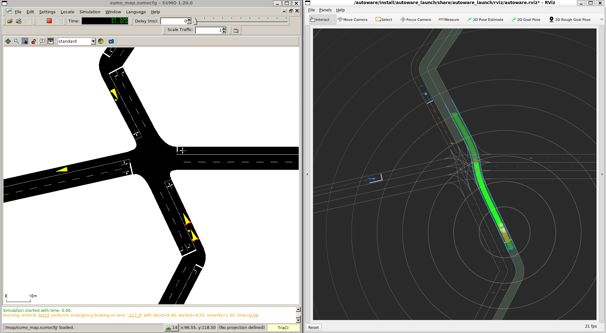

# SUMOWARE | SUMO - Autoware Bridge



## Project Structure

The repository is organized as follows:

```
sumoware_bridge/
├── src/                        # Source code directory
│   ├── sumoware/               # Main package containing the bridge implementation
│   └── tier4_autoware_msgs/    # Autoware message definitions
├── sumo_docker/                # Docker configuration for SUMO
├── launcher_autoware/          # Modified Autoware launch configurations
├── map/                        # Map-related files and utilities
├── example_inputs/             # Example input files
│   ├── map.xodr                # Example OpenDRIVE map file
│   └── scenario_params.json    # Example scenario parameters
```

## Running the simulation

Tested with WSL (Ubuntu 22.04) on Windows 11 with ROS2 Humble

Clone this repository, recursively
```
git clone git@github.com:TUM-VT/SumoWare.git --recurse-submodules
cd sumoware
```

Make sure ROS2 Humble is installed [ROS2 Humble](https://docs.ros.org/en/humble/index.html)

SUMO needs to be installed for map conversion: [SUMO Installation](https://sumo.dlr.de/docs/Installing/index.html)

Make sure [SUMO_HOME](https://sumo.dlr.de/docs/Basics/Basic_Computer_Skills.html#linux) environment variable is set

```
sudo apt-get install sumo sumo-tools sumo-doc
export SUMO_HOME=/usr/share/sumo
```

Make sure [docker](https://docs.docker.com/engine/install/ubuntu/) is installed

Add [docker user group](https://docs.docker.com/engine/install/linux-postinstall/)

Make sure [rocker](https://github.com/osrf/rocker) is installed
```
sudo apt-get install python3-rocker
```

Build sumo docker image with the name "sumo_docker"
```
docker build ./sumo_docker -t sumo_docker
```

Source the ROS2 installation
```
source /opt/ros/humble/setup.bash
```

Install dependencies
```
sudo apt install python3-rosdep2
sudo apt install python3-pip
sudo apt-get install ros-humble-tf-transformations
# pip install empy==3.3.4 # uncomment if colcon build fails
pip install requests==2.31.0 # for rocker compatibility
pip install --upgrade transforms3d
pip install commonroad-scenario-designer
rosdep update
rosdep install --from-paths src --ignore-src -r -y
```

Build the project
```
sudo apt install python3-colcon-common-extensions
colcon build --symlink-install
```

Source the project workspace
```
source install/local_setup.bash
```

Pull autoware image
```
docker pull ghcr.io/autowarefoundation/autoware:universe-cuda-20241010-amd64
```

Run the simulation with example data
```
ros2 run sumoware scenario_controller --ros-args -p use_sim_time:=true -p scenario_file:="./example_inputs/scenario_params.json" -p map_file:="./example_inputs/map.xodr" -p project_absolute_path:="$PWD" -p gpu_support:=true
```

To run without GPU support, disable the gpu_support toggle
```
ros2 run sumoware scenario_controller --ros-args -p use_sim_time:=true -p scenario_file:="./example_inputs/scenario_params.json" -p map_file:="./example_inputs/map.xodr" -p project_absolute_path:="$PWD" -p gpu_support:=false
```

For a step-by-step installation guide please click [here](https://github.com/TUM-VT/SumoWare/blob/main/docs/step-by-step-guide.md)

## Simulation Videos
Videos of simulations running SumoWare can be found [here](https://tinyurl.com/53fb278x).

## Contributors
Faruk Öztürk  
Evald Nexhipi   
Mathias Pechinger 

## Paper
If you use this repository, please cite our paper:

Öztürkle, F., Nexhipi, E., Pechinger, M., & Bogenberger, K. (2025). *SumoWare: Bridging SUMO and Autoware to Assess AV-Induced Traffic Impact*. IEEE IV 2025, 2415–2421. [DOI](https://doi.org/10.1109/IV64158.2025.11097507).

**BibTeX:**
```bibtex
@inproceedings{sumoware2025,
  title={SumoWare: Bridging SUMO and Autoware to Assess AV-Induced Traffic Impact},
  author={{\"O}zt{\"u}rkle, Faruk and Nexhipi, Evald and Pechinger, Mathias and Bogenberger, Klaus},
  booktitle={2025 IEEE Intelligent Vehicles Symposium (IV)},
  pages={2415--2421},
  year={2025},
  organization={IEEE},
  doi={10.1109/IV64158.2025.11097507}
}
```

## Disclaimer
This project contains code derived from [Autoware](https://github.com/autowarefoundation/autoware) and [tier4_autoware_msgs](https://github.com/tier4/tier4_autoware_msgs), licensed under the Apache License 2.0.
